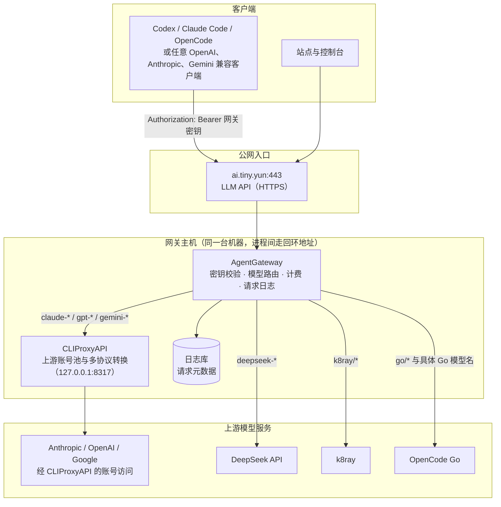

# 请求架构

这张图说明一次请求从客户端到上游模型服务经过哪些环节。图中每个组件都可以在 `agentgateway/` 的导出文件里找到对应配置。

## 每一跳的职责

**入口 `ai.tiny.yun:443`**：LLM 入口，负责 TLS。客户端用网关密钥（`Authorization: Bearer nc_ai_…`）认证，网关自己校验，模式是 `strict`，密钥与它所属的用户/分组一起存放在配置里，用来做鉴权、额度与日志归属。密钥在控制台创建后写入网关配置。

**AgentGateway**：做四件事——校验密钥、按模型名路由、按 token 用量乘参考价格计费、把请求元数据写进日志库。它不缓存也不落盘 prompt 内容（见 [透明度说明](transparency.md)）。

**部分请求转到 CLIProxyAPI**：模型名以 `claude-`、`gpt-`、`gemini-` 开头的请求走本机的 CLIProxyAPI（`127.0.0.1:8317`）。这个进程持有 Anthropic、OpenAI、Google 的上游账号，并做协议转换——例如客户端发 Claude 的原生 Messages 协议，网关可以直接透传过去；同一批模型也能用 Gemini 原生协议调用。

**另一部分直连上游**：`deepseek-*` 走 DeepSeek 官方 API，`k8ray/*` 走 k8ray，`go/*` 与已经具名的 Go 模型（`kimi-k3`、`mimo-v2.5`、`grok-4.6` 等）走 OpenCode Go。这些不经过 CLIProxyAPI，因为它们的上游本身就是 OpenAI 兼容接口，少一跳更直接。

**日志**：网关把每次请求的时间、状态、模型、token 数、参考成本、调用方写进日志库。上游服务自己的日志策略不在此列，例如 OpenCode 对数据的保留规则见其官方文档。

## 为什么这样分层

把"认证与路由"和"上游账号与协议适配"拆成两个进程，好处是上游账号（尤其是需要 OAuth 的）集中在 CLIProxyAPI 管理，网关只关心模型名到后端的映射；坏处是多一跳回环转发。对于本身就是 OpenAI 兼容、只需要一个 API key 的上游，直连更简单，所以这两条路径并存。

## 不在这张图里的部分

运维侧还存在一套私有网络，用于我们自己的机器访问这些服务、以及节点之间的互通。它不面向客户，涉及地址与访问方式，因此不随本仓库公开。
